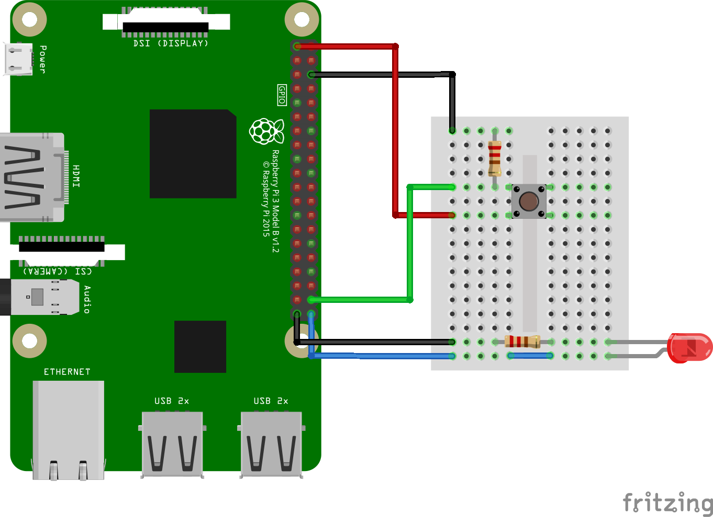

# 03_gpioctrl

An example driver for accessing GPIO pins as inputs and outputs without using the device tree.

This example can be compiled and run on a Raspberry Pi. I don't think it will work on other plattforms (other ARM based boards or x86).

## Hardware setup

## Finding the right GPIO number

- checking the GPIO number on [pinout.xyz](pinout.xyz)
- GPIO pins are organized in gpiochips
- list all gpiochips:
  ~~~
  pi@raspberrypi:~ $ gpiodetect 
  gpiochip0 [pinctrl-bcm2835] (54 lines)
  gpiochip1 [raspberrypi-exp-gpio] (8 lines)
  ~~~
- find gpiochips in sysfs
  ~~~
  ls /sys/class/gpio/
  export gpiochip0  gpiochip504 unexport
  ~~~
- Offsets are numbers before gpiochip
- Find out which is the right one
  ~~~
  cat /sys/class/gpiochip0/label
  pinctrl-bcm2835
  ~~~
- So, we have to use Offset 0

