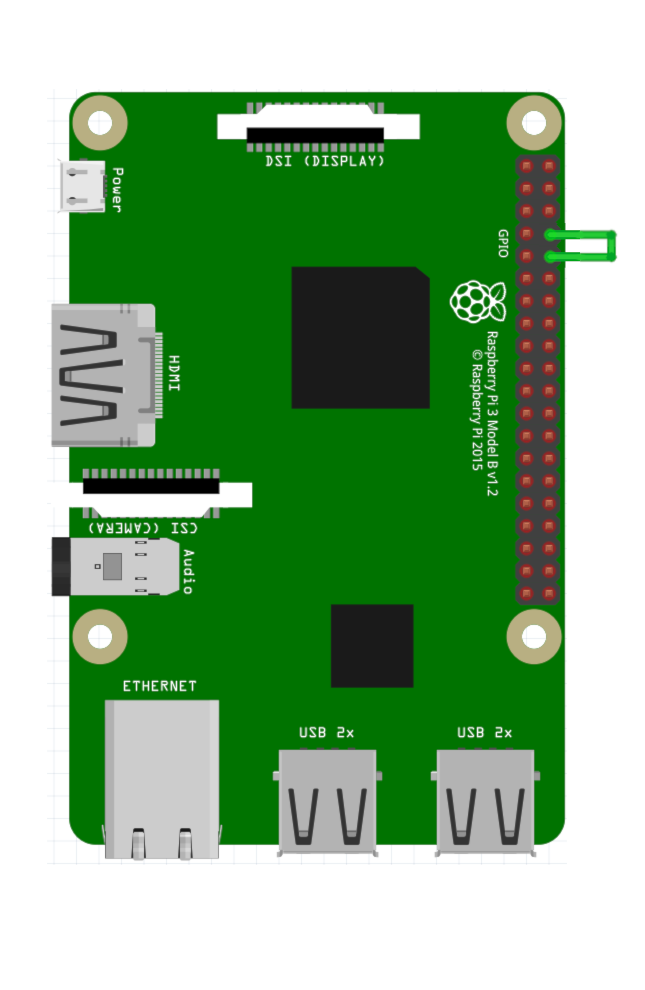

# 04_devicefiles

This is an introduction to device files, device numbers, block & character devices.

## Device files

Device files can be used as an interface between the userpace and a Linux driver or kernel module. Typically the device files live in the /dev folder but they can be created anywhere. Most device files are temporary files and when you turn off your Raspberry Pi, plug the SD-Card into a card reader on your PC and navigate into the dev folder, it will be almost empty.

Here is how a regular file looks like when displayed with the ls command:

~~~
-rw-r--r-- 1 pi pi 1169 Dec  6 20:08 README.md
~~~

The leading *-* indicate, it is a regular file, the next part are the file permissions. The 1 is the number of hardlinks pointing to the file. Then we can see the owners and the group of the file. 1169 is the size of the file in bytes. Finally we have the last modified date and the filename. 

When looking at device files, the ls output looks a little bit different:

~~~
crw-rw---- 1 root gpio    254,  0 Dec  7 14:07 /dev/gpiochip0
brw-rw---- 1 root disk    179,  0 Dec  7 14:07 /dev/mmcblk0
brw-rw---- 1 root disk    179,  1 Dec  7 14:07 /dev/mmcblk0p1
crw-rw---- 1 root dialout   4, 64 Dec  7 14:07 /dev/ttyS0
~~~

The output looks similar but there are two differences. First, the leading letter of the devices.

## Character and block devices

Instead of the *-* for a regular file, we know see a *c* and a *b*. *c* stands for character and *b* for block device. Character and block is an indication how the various devices are organized.

*mmcblk0* is the device file over which we can access the SD Card of the Raspberry Pi. For SD Cards data is transferred in blocks. This means, you can only read a block (e.g. 512 Bytes) from an SD-Card. 

*ttyS0* is the device file over which we can access the serial port of the Raspberry Pi. On serial ports, data is transferred in Bytes or characters. So, the name also makes sense.

## Device Numbers

The next difference between a device file and regular files is that for device files ls doesn't show the file size. Instead it shows two numbers, e.g. 254, 0 for /dev/gpiochip0. These numbers are the so called Device Numbers. Device Numbers are split in a Major and a Minor device number. E.g. for /dev/gpiochip0 the Major Device Number is 254 and the Minor Device Number is 0.

The link between a driver and the device file is made exclusively over the Device Number. To find out which Devices Numbers are used on your system, take a look at the */proc/devices* file. If we search for the Device Numbers listed above, we can find the following:

~~~ 
grep 179 /proc/devices 
179 mmc
grep 4 /proc/devices 
  4 /dev/vc/0
  4 tty
  4 ttyS
grep 254 /proc/devices 
254 gpiochip
~~~ 

In this file, only the major device numbers are shown. Typically a driver allocates a major device number and a range of minor device numbers. Minor device numbers can be 0 to 255. In the ls command, we could see, that the Device File for our SD Card *mmcblk0* and for the first partition *mmcblk0p1* is using the same Major Device Number, only the Minor Device Number is different.

If the same driver is used for multiple devices, it is common that it is using the same Major Device Number.

## Creating Device Files

To demonstrate the link between a Device File and a Driver is indeed the Device Number, let's try out  a small experiment:

With hexdump we can display the bytes written on our SD-Card:

~~~
sudo hexdump /dev/mmcblk0 | head
0000000 b8fa 1000 d08e 00bc b8b0 0000 d88e c08e
0000010 befb 7c00 00bf b906 0200 a4f3 21ea 0006
0000020 be00 07be 0438 0b75 c683 8110 fefe 7507
0000030 ebf3 b416 b002 bb01 7c00 80b2 748a 8b01
0000040 024c 13cd 00ea 007c eb00 00fe 0000 0000
0000050 0000 0000 0000 0000 0000 0000 0000 0000
*
00001b0 0000 0000 0000 0000 0e14 cf49 0000 0000
00001c0 4001 030c ffe0 2000 0000 0000 0010 0300
00001d0 ffe0 7f83 ffff 2000 0010 1000 01cc 000
~~~

Now, if we navigate into our home folder and create a new Device File with the same Device Number, we should be able to also read out the content of the SD Card. For creating a Device File, we will use the *mknod* command:

~~~
cd
sudo mknod mymmc b 179 0
~~~

The first parameter of mknod is the filename of the device file, then the type (*b* for *block device*) and finally the Major and Minor Device Number. So, now let's hexdump this device file:

~~~
sudo hexdump mymmc | head
0000000 b8fa 1000 d08e 00bc b8b0 0000 d88e c08e
0000010 befb 7c00 00bf b906 0200 a4f3 21ea 0006
0000020 be00 07be 0438 0b75 c683 8110 fefe 7507
0000030 ebf3 b416 b002 bb01 7c00 80b2 748a 8b01
0000040 024c 13cd 00ea 007c eb00 00fe 0000 0000
0000050 0000 0000 0000 0000 0000 0000 0000 0000
*
00001b0 0000 0000 0000 0000 0e14 cf49 0000 0000
00001c0 4001 030c ffe0 2000 0000 0000 0010 0300
00001d0 ffe0 7f83 ffff 2000 0010 1000 01cc 000
~~~

You can see, that the output is identical. 

Let's do the same for a Character device. If you shorten the TX and RX pins of the Raspberry Pi with a jumper and enable the serial port and disable a login console over the serial port in *raspi-config*, you can access the serial port over a serial terminal, like screen:

~~~
screen /dev/ttyS0 9600
~~~

Every character you are typing is echoed back. Now, let's create a Device File for a Character Device:

~~~
cd
sudo mknod myserial c 4 64
~~~

Now if we open this file in screen and type something it is also echoed back:

~~~
sudo screen myserial 9600
~~~

The key message here is that the link between a Device File and a Driver is done not over the name of the Device File but only over the Device Numbers.

