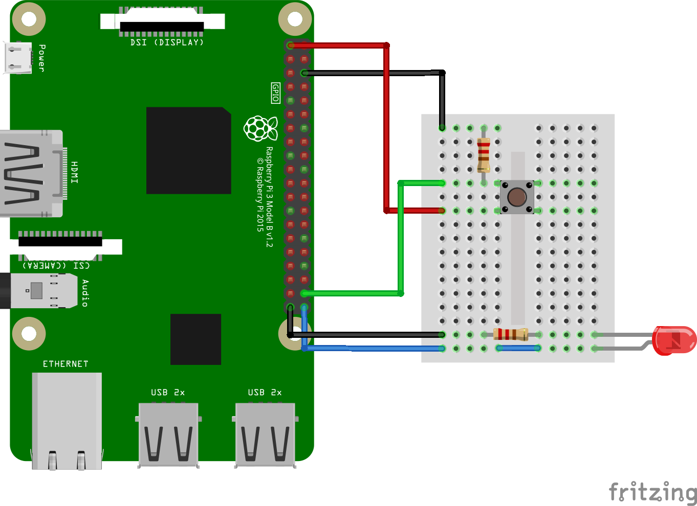

# 19_dt_dev_gpios

In this lecture you will learn how to use GPIOs in a device tree device driver.

This example can be compiled and run on a Raspberry Pi. I don't think it will work on other plattforms (other ARM based boards or x86).

## Hardware setup

The LED is connected to GPIO21, the button to GPIO20.

## Adding GPIOs to the device tree device

First, we have to add the GPIOs in the device tree overlay. Therefore, we need to find out the device tree node name of the GPIO controller the GPIOs are connected to. You can do so, by checking the device tree, e.g. with:

~~~
cat /proc/device-tree/soc/gpio@7e200000/name
gpio
~~~

So, the name of the GPIO controller node is `gpio`. With this knowledge we can add the LED and button:

~~~
led-gpio = <&gpio 21 0>;
button-gpio = <&gpio 20 0>;
~~~

When declaring a GPIO property, you must use the suffix `-gpio`. This allows the detection of the gpio pins. The first argument is a pointer to the GPIO controller node, the second one is the number of the GPIO. The last one configures the GPIO for active high.

The Device Tree gives us some hardware abstraction. Compared to lection 3 where we needed to hardcode the GPIO pin numbers in the driver, here we can just add a second device and change the GPIO numbers.

## Adding the GPIOs to the Linux Device Driver

In the driver we add two global pointers from the type `struct gpio_desc`. These pointers will store our GPIO pins. Using global variables here is not the best way to do it, in the next lection I will show you a better way.

In the probe function we have to read out the GPIO properties from the device and then configure the GPIOs. We can do so with the functio `gpiod_get`. This function needs a pointer to the device to search for the property as a first argument. The second argument is the property label without the `-gpio` suffix. The last argument is how we want to configure the GPIO. For the LED we choose `GPIOD_OUT_LOW` for the button `GPIOD_IN`.

After each call, we check if we got a valid pointer back. Then we can use the GPIOs, e.g. turn the LED on with `gpiod_set_value` or read in the button's state with `gpiod_get_value`.

In the remove function, we turn off the LED and then free the GPIO descriptors with `gpiod_put`

## Testing

~~~
# Compile the code and the dt overlay
make
# Load driver
sudo insmod my_dev_driver.ko

# Insert the dt overlay
sudo dtoverlay my_overlay.dtbo

# You should now see that the LED is on
# In the kernel's log you can find the state of the button

# Remove the dt overlay
sudo dtoverlay -R my_overlay

# Unload the driver
sudo rmmod my_dev_driver
~~~
