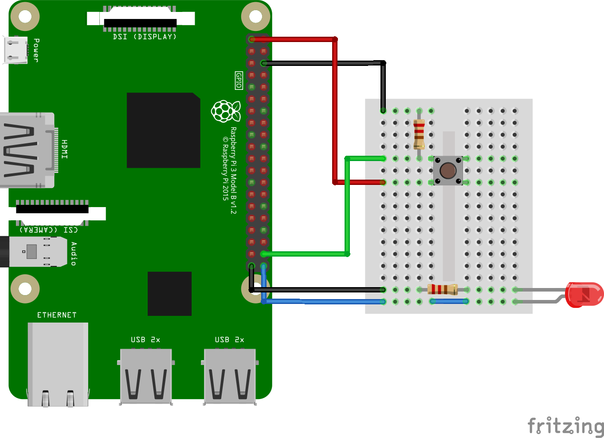

# 22_platform_misc

In this lecture you will learn how to add an interface so the driver can communicate with the userspace..

This example can be compiled and run on a Raspberry Pi. The driver should also work on other ARM based platforms but the device tree overlay must be adopted.

## Hardware setup

The LED is connected to GPIO21, the button to GPIO20.

## Problems with the last platform driver

The driver for our platform device can successfully access the GPIOs, control the LED and read in the button. But it has a problem. The hardware is only accessed in the probe and in the remove function. The userspace has no way of communicating with the driver and e.g. set the LED. So, let's add a misc device so the driver can communicate with userspace.

## Adding the misc device

Every compatible device added to the system should get its own misc device over which the hardware can be controlled. Therefore, we add an object from the type `struct miscdevice` to the driver's device data struct. 

In the probe function we know also allocate the memory for this misc device. After initializing the hardware we setup and register the misc device by setting the file operations, the minor device number and the name of the device.

As each compatible device should get their own misc device and therefore own device file, we need to add a number to the name of the misc device. Therefore, we are using a global int variable `devcnt` to keep track of how many devices we already have. We add the number to the device file's name (e.g. my_dev0) and then increment it. 

After setting up the misc device, we can register it and create the device file with the function `misc_register`.

In the remove function, we need to deregister the misc device and thereby remove the device file and decrement the `devcnt` variable.

## Adding function callbacks

The last thing we need to do, is to add the function callbacks our misc device should support. With the read function the driver should read out the state of the button and with the write function the LED can be controlled. But we have a problem: We need to access the device's data for the device for which the function callback was called. Luckily, the misc device sets the `private_data` field of the pointer to the file. But now we need to get the device's data over this pointer.

To achive this, we will add the function `to_my_dev_data`. We can pass a file pointer to this function and it will return the device's data for the device the function was called for. We declare the function as inline to save some time when calling it (e.g. no stack management required for an inline function). The function reads out the private data of the file pointer which is a pointer to the misc device. Then it calls the macro `container_of`.

If you want to know in detail what this macro does, I recommend [this article](https://radek.io/posts/magical-container_of-macro/). But to break it down, the macro returns a pointer to the device data when passing a pointer to a field of the struct. 

In the read and write callback functions, we retrieve the device data with the file pointer and then we can access the LED or the button.

## Testing

~~~
# Compile the code and the dt overlay
make
# Load driver
sudo insmod my_dev_driver.ko

# Insert the dt overlay
sudo dtoverlay my_overlay.dtbo

# You should see the follwing device:
 ls -l /dev/my_dev0 
crw------- 1 root root 10, 121 Feb  4 20:32 /dev/my_dev0

# This will turn on the LED
echo 1 | sudo tee /dev/my_dev0

# This will turn off the LED
echo 0 | sudo tee /dev/my_dev0

# This is how to read out the button
sudo cat /dev/my_dev0 
Button is not pressed

# Remove the dt overlay
sudo dtoverlay -R my_overlay

# Unload the driver
sudo rmmod my_dev_driver
~~~
